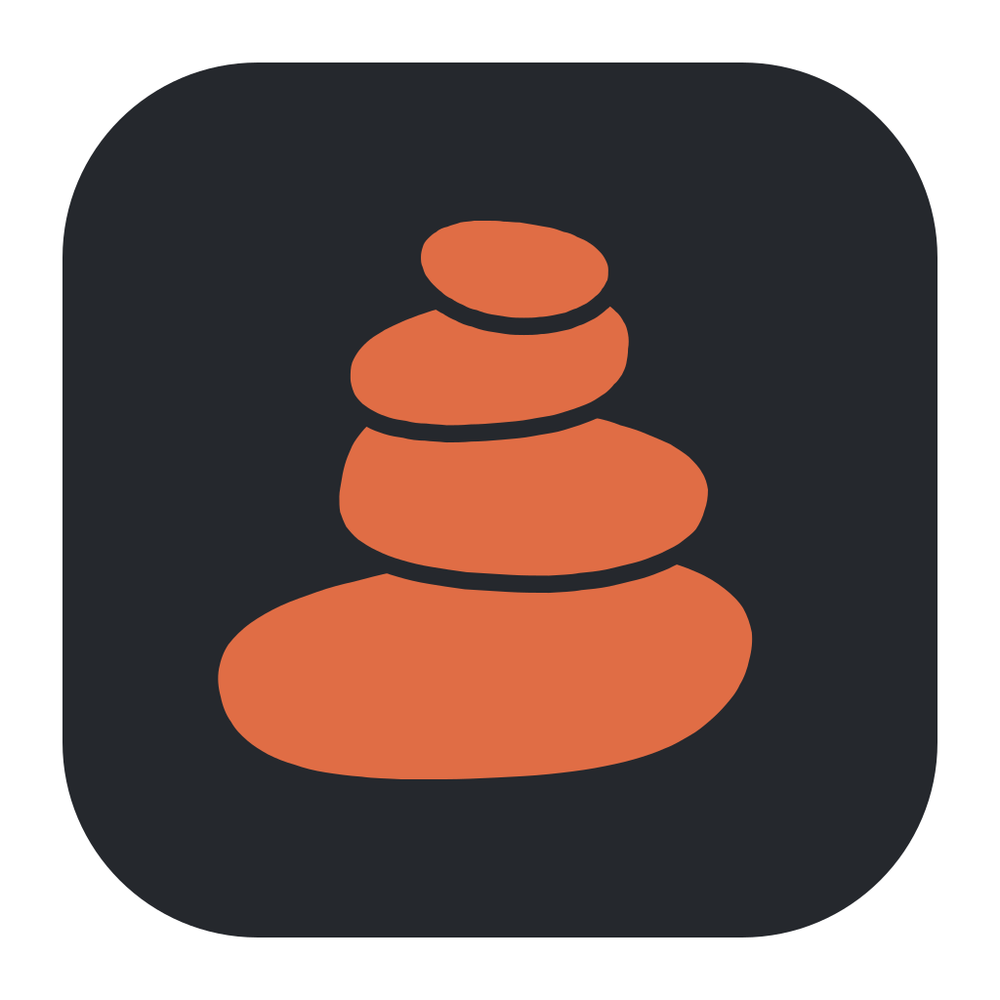
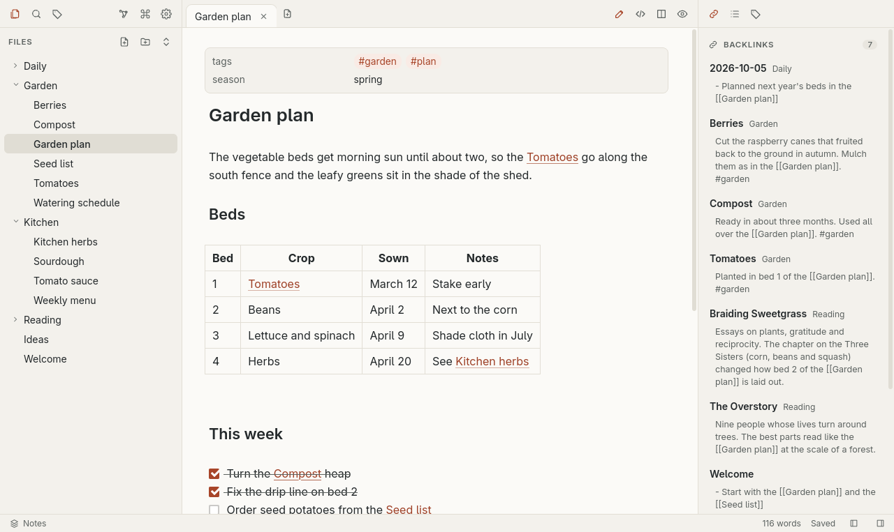
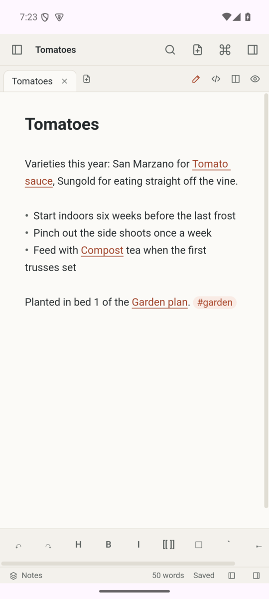
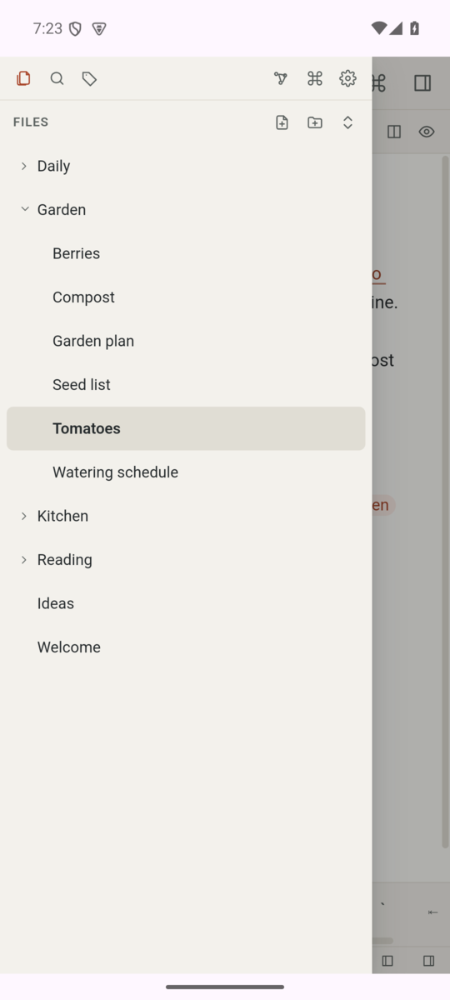

<p align="center">
  
</p>

<h1 align="center">Cairn</h1>

Cairn is a local-first Markdown notes app in the style of Obsidian. A vault is an ordinary folder of `.md` files: Cairn reads and writes those files directly, so you can open the same folder in any other editor, put it under Git, or back it up however you like. The search index and link graph live in memory, and Cairn rebuilds them from the files.

[docs/PLAN.md](docs/PLAN.md) has the design, the stack decisions and the status of each version. [docs/RELEASE_NOTES.md](docs/RELEASE_NOTES.md) describes each release. Section 9 of [docs/PLAN.md](docs/PLAN.md#9-known-limits) lists the known limits.

## Screenshots



| Graph view (dark theme) | Full-text search |
|:---:|:---:|
|  |  |

<p align="center">
  
  &nbsp;&nbsp;
  
</p>

## Features

- Open any folder as a vault, or create a new one. If you type a path where there is no folder, Cairn asks before it creates a vault there (`~` means your home folder). Cairn remembers recent vaults.
- File tree with expand/collapse, new note, new folder, inline rename (double-click or F2), delete to the system trash (Delete key or context menu) and drag-and-drop moves. Large folders stay fast because Cairn draws only the visible rows. The tree also works from the keyboard: the arrow keys move through it, Enter opens a note, and Shift+F10 or the Menu key opens a row's menu. Cairn refuses to create, rename or move an entry to a name that differs only in case from another one in the same folder, because macOS, Windows and Android shared storage would treat the two as one file. Changing only the case of an entry's own name works.
- Changes made outside Cairn (another editor, `git pull`, a file manager) show up in the tree and in open notes within about a second. If a note, or a folder it is in, is renamed outside Cairn, the note stays open in its tab.
- Tabs with autosave. If a file changes on disk while you have unsaved edits, Cairn merges the change into your edits when the two change different lines that are not next to each other. If they touch the same or neighbouring lines, or either side rewrote more than about 10,000 lines (lines only added or only removed in one place do not count), it stops and asks instead of overwriting either version. Edits that Cairn could not save (a conflict, a read-only file, a failed write) stay in their tab, and closing the tab, switching vaults or closing the window asks first.
- Live Preview editing: Markdown renders as you type, and the syntax comes back on the line you are editing. Source mode, reading view and a side-by-side split each take one click, and Ctrl+E switches between editing and reading.
- `[[wikilinks]]` with autocomplete after `[[`, aliases (`[[note|text]]`), heading and block links, links by path (`./` and `../` are relative to the note the link is in), and Obsidian's resolution rules. Clicking a link to a missing note creates it. Alt+Enter follows the link at the cursor. Ctrl+click opens a link in a new tab, and so does a middle click in the editor.
- Embeds: `![[note]]`, `![[note#heading]]`, images (`![[photo.jpg|300]]`), audio and video. A small text file (up to 256 KB) embeds as text; any other file embeds as a card with its name.
- Paste or drop images and other files into a note. Cairn stores them in the vault's attachment folder and links them.
- On the desktop, you can open a file that is not a note in the system's default app from a link, from the card of an embedded file, or from the file tree (click it, or choose Open in default app in its menu). Cairn does this only for documents, images, audio, video, archives and a few text formats (txt, log, csv, tsv, rtf, svg, json, yaml, yml, ics, vcf). It refuses any other type (programs, scripts, web pages, XML, macro-enabled Office files) and text files marked as executable, and suggests Reveal in file manager instead. On Android, Cairn cannot open attachments in other apps yet.
- Backlinks, outgoing links, outline, properties (frontmatter) and tags panels.
- Quick switcher (Ctrl+O), command palette (Ctrl+P), full-text search with `tag:` and `path:` filters (Ctrl+Shift+F; quote a value with spaces, as in `path:"My Folder"`), and a graph view (Ctrl+G) that also works from the keyboard.
- Light and dark themes, accent color, fonts, and your own CSS snippets. On the desktop, Ctrl+= and Ctrl+- zoom the whole window and Ctrl+0 resets it (on layouts where that key types 0, so not on AZERTY); the Font size setting changes only the note text.
- Customizable hotkeys for every command, all listed under Settings, then Hotkeys. A hotkey needs Ctrl, Alt or Cmd unless it is a function key. It goes by the character the key types in your keyboard layout (AZERTY, Dvorak and so on).
- End-to-end encrypted sync between devices through your own server, with conflict copies instead of lost edits, and version history.
- An Android app built from the same code, with a touch layout and a formatting toolbar. It has no zoom keys and cannot open attachments in other apps yet.

Settings live in `.cairn/settings.json` inside the vault, and CSS snippets in `.cairn/snippets/`. The tree, search and the graph ignore folders whose names start with a dot. Cairn also does not open or display files inside them, so an image kept in a dot-folder does not show in a note.

Cairn follows the symlinks in a vault. Linked notes and folders show up and you can edit them, and saving a linked note keeps the link (hard links too). A folder link that loops back (`loop -> .`) is skipped. Under `.cairn/`, Cairn reads through links but writes only inside the vault: when it saves a settings or snippet file that links out of the vault, it replaces the link with a plain file. If a folder on the way (`.cairn` itself, or `.cairn/snippets` for a snippet) links out of the vault, Cairn writes nothing there and shows an error such as "Could not save settings: The ".cairn" folder leads outside the vault." A folder you can reach under two names (a link to a folder of the vault, or two links to one folder) shows and syncs under both. Deleting one copy on another device can move the real notes to the trash. See the known limits in [docs/PLAN.md](docs/PLAN.md#9-known-limits).

If one folder holds two file names that differ only in their Unicode form (for example `café.md` saved on Linux and on a Mac), Cairn shows the second as `café (Unicode twin).md`. It is the real file under another name: it opens, saves and syncs like any note, and renaming it in Cairn renames the file on disk. Cairn does not show or sync files and folders whose names contain a backslash (possible on Linux and Android). To use them in Cairn, rename them in another app. With sync on, Settings, then Sync, lists them under "Files not synced" with the reason "The name contains a backslash. Rename it to sync it." If a synced note gets such a name outside Cairn, it counts as deleted, so the other devices move it to their trash.

Keyboard shortcuts use Cmd instead of Ctrl on macOS.

## Building and running

Prebuilt Linux packages, the Android APK and the sync server's Docker image are on the [releases page](https://github.com/lucas-pospor/cairn/releases). To build Cairn from source, you need:

- Rust 1.90 or newer (`rustup` or your distribution's package)
- Node.js 22.12 or newer and npm (Vitest runs on Node 22, 24, and 26 or later)
- The Tauri system dependencies for your platform, listed at <https://tauri.app/start/prerequisites/>

Platform notes:

- Linux: WebKitGTK 4.1 and its development headers. On Debian or Ubuntu: `sudo apt install libwebkit2gtk-4.1-dev build-essential curl wget file libxdo-dev libssl-dev libayatana-appindicator3-dev librsvg2-dev`. On Arch: `sudo pacman -S webkit2gtk-4.1 base-devel curl wget file openssl appmenu-gtk-module libappindicator-gtk3 librsvg`.
- macOS: Xcode Command Line Tools (`xcode-select --install`).
- Windows: Microsoft C++ Build Tools and WebView2 (already present on Windows 10 and 11).

Install the JavaScript dependencies once:

```bash
cd app && npm install
```

Run in development mode, with hot reload for the UI:

```bash
cd app && npx tauri dev
```

Build installable packages for the current OS (Linux: `.deb`, `.rpm` and AppImage; macOS: `.app` and `.dmg`; Windows: `.msi` and `.exe`):

```bash
cd app && npx tauri build
```

The packages end up in `target/release/bundle/`.

You can pass a vault path on the command line (`cairn ~/Notes`) or set `CAIRN_VAULT`. Without either, Cairn reopens the last vault.

### Android

The Android app is built from the same code. In addition to the above, you need:

- `rustup` with the Android targets: `rustup target add aarch64-linux-android armv7-linux-androideabi i686-linux-android x86_64-linux-android` (a distribution's Rust package cannot add targets)
- JDK 17 or newer
- The Android SDK with platform 37, build tools, the NDK and platform tools. With the command-line tools: `sdkmanager "platform-tools" "platforms;android-37.0" "build-tools;36.0.0" "ndk;29.0.14206865"`

`scripts/android-env.sh` sets `ANDROID_HOME`, `NDK_HOME`, `JAVA_HOME` and `PATH` for the default locations; edit it if yours differ.

```bash
. scripts/android-env.sh
```

Build an APK for phones (arm64) and for the x86_64 emulator:

```bash
cd app && npx tauri android build --apk --target aarch64 --target x86_64
```

For a debug build on a connected phone or a running emulator:

```bash
cd app && npx tauri android dev
```

You have to sign a release APK before you can install it. See <https://tauri.app/distribute/sign/android/>.

On Android, "Create a vault on this device" keeps the vault in the app's private storage. "Open a folder from storage" uses the system folder picker (Storage Access Framework), so you can share the folder with other apps. Opening a folder this way needs no storage permission. Sync works as on the desktop, except for the names a shared folder cannot hold (below).

The app reopens a shared folder after a restart as long as it still has access to it. If another app renames, moves or deletes the folder, Cairn treats it as missing: sync stops with "Sync error" and uploads nothing, so the other devices keep their notes. Pick the folder again in its new place.

Shared storage ignores case, so Cairn refuses a name that differs only in case from an existing one there. It also refuses names that the storage cannot hold: names with `" * : < > ? \ |`, a trailing dot, or more than 255 bytes. When another device syncs a file under such a name, or into a folder whose name differs only in case from one on the phone, the phone does not store the file, and no device renames it. The phone lists it under "Files not synced" in Settings, then Sync. There is one exception: when another device moves some notes from a folder into one whose name differs only in case, the phone renames its whole folder to match, so the folder's other notes move on every device too. When another device renames a note to such a name, the phone holds the rename back, and edits made to that note on the phone wait until the name is free. The known limits in [docs/PLAN.md](docs/PLAN.md#9-known-limits) describe this and a related case.

## Sync server

Sync goes through a small server you run yourself. It stores notes and file names only in encrypted form. Each device encrypts them with a random vault key that only your passphrase unlocks, so the server never sees the content or the name of any file. The server does see the vault name, the name of each device (set in the setup form, where it starts as the host name on Linux, or "Android" on a phone), how many files the vault has, which changes belong to the same file, and the size, upload time and kind of each change.

With Docker Compose and Caddy (automatic HTTPS):

1. Point a DNS name at the machine and put it in `crates/cairn-server/Caddyfile`.
2. Create `crates/cairn-server/.env` containing `CAIRN_TOKENS=` followed by a long random secret (for example the output of `openssl rand -hex 24`).
3. Start it:

```bash
cd crates/cairn-server && docker compose up -d
```

Without Compose, build and run the image directly (from the repository root):

```bash
docker build -f crates/cairn-server/Dockerfile -t cairn-server .
```

```bash
docker run -d --name cairn -p 8787:8787 -v cairn-data:/data -e CAIRN_TOKENS=your-secret cairn-server
```

To use the image from a release instead of building it, load it with `docker load -i cairn-server-1.0.0-docker-image.tar.gz` and use `cairn-server:1.0.0` as the image name.

Or run the binary without Docker: `cargo run --release -p cairn-server` with `CAIRN_TOKENS` set. The server reads its settings from environment variables: `CAIRN_TOKENS` (required, comma-separated), `CAIRN_DATA` (database folder, default `./data`), `CAIRN_ADDR` (default `0.0.0.0:8787`), `CAIRN_MAX_BODY_MB` (default 200). Cairn sends and reads at most 200 MB per request, and files travel base64-encoded, so the largest file that syncs is about 150 MB. A lower `CAIRN_MAX_BODY_MB` lowers that limit, but a higher one does not raise it.

Put the server behind HTTPS. The content is encrypted either way, but the access token is not.

The server closes a connection that sends no request for 10 seconds. The Caddyfile in the repository keeps idle connections to the server for 5 seconds. If you use another reverse proxy, set its idle timeout for connections to the server below 10 seconds as well. The server logs each request that has a missing or wrong token, together with the client's address (behind a reverse proxy, that is the proxy's address).

Then, on each device, open Settings, then Sync, and enter the server URL, the token, a vault name and the passphrase. Use the same vault name and passphrase everywhere. If the server has no vault with that name, Cairn asks "There's no vault called X on this server. Create it?" and creates it only if you say yes, so a mistyped name does not start a second, empty vault. If the URL points at a wrong path or at another web server, setup stops with "server error: there is no Cairn sync server at this address. Check the URL". If you lose the passphrase, nobody can decrypt the data on the server, not even you. The notes on your devices are not affected.

Sync runs a few seconds after you stop typing, every minute, and when you click the sync status in the status bar. If a sync you start yourself (by clicking the sync status, or with Sync now in the command palette) fails, a message says why. If both devices change a note before they sync and the changes touch the same or neighbouring lines, or either side rewrote more than about 10,000 lines, Cairn keeps both. It saves the other version next to yours as "Note (conflict date device).md" and lists it under "Conflict copies" in Settings, then Sync. If one device renames a note, or the folder it is in, and another deletes the note, Cairn keeps the note under the new name. A note renamed or moved in Cairn keeps its version history even when you edit it before the next sync. A note renamed outside Cairn and edited before the next sync counts as deleted and new: its history starts again, and the other devices move the old note to their trash. Deleted files go to the trash (`.trash/` in the vault on Android). With sync on, "Version history" in a file's menu in the file tree ("Show version history of current note" in the command palette) shows earlier versions of a note and can restore them. Restoring syncs first, so the text it replaces stays in the history. If that sync fails, Cairn restores nothing.

A file that cannot sync does not hold up the others. The status bar then says "Synced · 1 file not synced", and Settings, then Sync, lists each such file under "Files not synced" with its reason: too large, refused or stalled on upload, unreadable here, not decryptable, not writable on this device (for example a name the phone's shared storage does not allow, or one that differs only in case from another file there), a change the server no longer has, or a name with a backslash. A file drops off the list once it syncs.

In two cases sync stops without uploading anything, and the sync status shows "Sync error" with the reason in its tooltip and in Settings, then Sync. The first is a vault folder with no files at all on a device that has synced before, for example a moved folder or an unmounted drive. Files in hidden folders such as `.cairn` and `.trash` do not count. If you deleted every note on purpose, add a note and sync again. The second is a server that has lost changes this device has seen, or no longer has the vault. In that case, turn sync off in Settings, then Sync, and connect again.

Connecting again, or losing the sync state on a device, does not duplicate notes: Cairn matches the device's files to the server's by path and content. It does not delete anything at that point, so a note deleted on one side comes back everywhere. On a first connect, if a new file's content matches a server note this device lacks, Cairn takes the file as that note, and the note then moves to the file's path on the other devices. This happens only when the match is one to one, and never for empty files.

## Plugins

A plugin is a JavaScript file in `.cairn/plugins/` inside the vault. Turn it on under Settings, then Plugins, on each device where it should run. Each plugin runs in its own sandbox (a Web Worker) with no access to the page, the network or the file system. It talks to Cairn only through the `cairn` object, and only with the permissions it declares at the top of the file:

```js
// @name Selection stats
// @description Counts the words in the selection.
// @permissions editor
cairn.commands.register("count", "Count selected words", async () => {
  const text = await cairn.editor.getSelection();
  await cairn.ui.toast(`${text.split(/\s+/).filter(Boolean).length} words`);
});
```

The API: `cairn.commands.register(id, name, handler)` and `cairn.ui.toast(text)` (always allowed); `cairn.notes.list()` and `cairn.notes.read(path)` (permission `read`); `cairn.notes.write(path, content)` (permission `write`); `cairn.editor.activePath()`, `cairn.editor.getSelection()` and `cairn.editor.replaceSelection(text)` (permission `editor`). `notes.read` and `notes.write` reach only Markdown notes outside dot-folders, and never leave the vault through a symlink. A plugin can register up to 200 commands, which appear in the command palette and can get hotkeys. A command still running after 2 seconds shows a notice. If a plugin's command runs for more than 30 seconds, or the plugin stops responding or floods the app with messages, Cairn stops the plugin and turns it off. Plugins have no memory limit, so a plugin that keeps allocating memory can make the window go blank.

Turning a plugin on records an approval on that device only, in `plugin-approvals.json` in Cairn's configuration folder (`~/.config/app.cairn.notes/` on Linux), never in the vault. The approval holds a hash of the plugin file and the permissions you approved, so a change to the file, or moving the vault folder, turns the plugin off until you turn it on again. A plugin that the vault lists but this device has not approved stays off, and a toast says so when you open the vault. Only `.js` files directly in `.cairn/plugins/` can run, so Settings, then Plugins, lists every plugin that can run.

## Tests

Core logic (file operations, change detection, link parsing and resolution, search):

```bash
cargo test -p cairn-core
```

The sync server has its own tests:

```bash
cargo test -p cairn-server
```

So does the Rust code of the app itself (`app/src-tauri`, package `cairn`). Run its unit tests with `--lib`, which builds only the tests and leaves the built app alone:

```bash
cargo test -p cairn --lib
```

UI logic (tree building, link helpers, Markdown rendering):

```bash
cd app && npm test
```

Type-check the UI:

```bash
cd app && npm run check
```

End-to-end tests drive the real app through WebDriver, so they need `tauri-driver` (the tests look for it in `~/.cargo/bin`, or set `TAURI_DRIVER`) and, on Linux, `WebKitWebDriver` (shipped with WebKitGTK on most distributions; Debian and Ubuntu package it as `webkit2gtk-driver`). WebDriver testing is not available on macOS.

```bash
cargo install tauri-driver --locked
cargo build -p cairn-server
cd app && npm run e2e:build && npm run e2e
```

The tests create a throwaway vault in the system temp folder and check the results on disk. `e2e/sync.test.mjs` also starts a sync server (`target/debug/cairn-server`) and uses the `sync_dir` example as a second device. `npm run e2e:build` builds the app and the `sync_dir` example but not the server binary, so build that with `cargo build -p cairn-server` as shown.

Run the Rust tests per crate, with `-p`. A plain `cargo build`, or `cargo test` at the workspace root, relinks `target/debug/cairn` without the UI built in. That binary expects the Vite dev server, so the end-to-end tests stop working until you run `npm run e2e:build` again.

On Linux, to run end-to-end test files without windows on your desktop, or several runs at once, use `scripts/e2e-headless.sh` from the repository root. It needs `mutter`: each run gets its own headless Wayland display (`mutter --headless`) and its own WebDriver ports (`CAIRN_WD_PORT` and `CAIRN_WD_NATIVE_PORT`). It passes its arguments to `node --test`:

```bash
scripts/e2e-headless.sh e2e/app.test.mjs e2e/sync.test.mjs
```

Two more desktop test files are in `scripts/`. `npm run e2e` does not run them, so use the headless runner:

```bash
scripts/e2e-headless.sh scripts/adv-fs-e2e.test.mjs scripts/adv-links-e2e.test.mjs
```

Sync engine tests, including two simulated devices that edit, rename and delete concurrently through a real server, and a randomized test that checks that the devices converge without losing any edit (`CAIRN_FUZZ_SEEDS` sets how many random runs):

```bash
cargo test -p cairn-sync
```

Without `CAIRN_FUZZ_SEEDS`, that is 8 or 30 runs, depending on the test. After a change to sync, run more, for example 200:

```bash
CAIRN_FUZZ_SEEDS=200 cargo test -p cairn-sync
```

Android end-to-end tests run on an emulator or phone through adb (they clear the app's data). The test files share the device, so run them one at a time, from the repository root after `. scripts/android-env.sh`:

```bash
node --test --test-concurrency=1 e2e/android/*.test.mjs
```

They need a debug APK (`cd app && npx tauri android build --debug --apk --target x86_64` for the emulator), the `sync_dir` example from `npm run e2e:build` and the server binary from `cargo build -p cairn-server`.

The emulator's memory use grows over long runs. `scripts/adv-android-run-all.sh` runs each test file on a freshly booted emulator instead, using an AVD named `cairn-test`. It runs every file in `e2e/android/`, or the files you name, writes logs to `e2e/.tmp/android-run/` and prints a summary at the end:

```bash
scripts/adv-android-run-all.sh e2e/android/adv_saf.test.mjs
```

## Performance testing

Generate a large vault and time how long the core takes to open and query it:

```bash
node scripts/gen-vault.mjs /tmp/big-vault 10000
```

```bash
cargo run --release -p cairn-core --example bench_open -- /tmp/big-vault
```

The app logs how long it took from process start to the first painted screen (`UI ready ... ms after process start`).

## Project layout

```
crates/cairn-core/   vault, file system abstraction, parser, index, search (Rust, no UI)
crates/cairn-sync/   sync protocol, encryption, merge rules, client engine
crates/cairn-server/ sync server (axum + SQLite), Dockerfile, compose file, Caddyfile
app/src-tauri/       Tauri shell: commands, file watcher, sync thread, vault:// protocol
app/src-tauri/gen/android/  Android project; SafPlugin.kt is the Storage Access Framework bridge
app/src/             Svelte UI and CodeMirror extensions
e2e/                 end-to-end tests against the built app (WebDriver on the desktop, adb on Android)
scripts/             build, test and benchmark helpers
docs/PLAN.md         plan, decisions, status, known limits
docs/RELEASE_NOTES.md  what is in each release
docs/images/         screenshots used in this README
LICENSE              MIT license
```

## License

MIT (see [LICENSE](LICENSE)).
