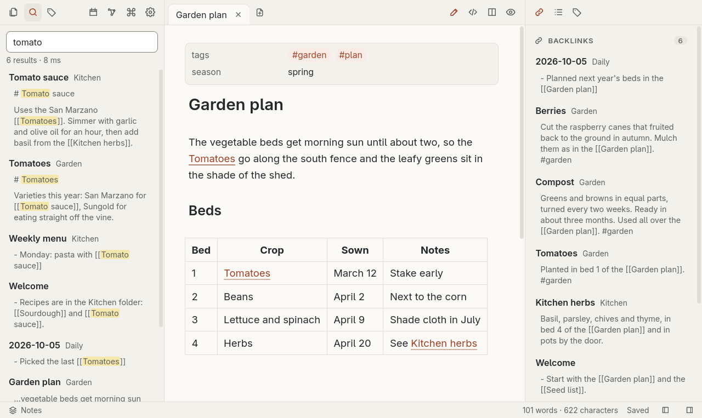
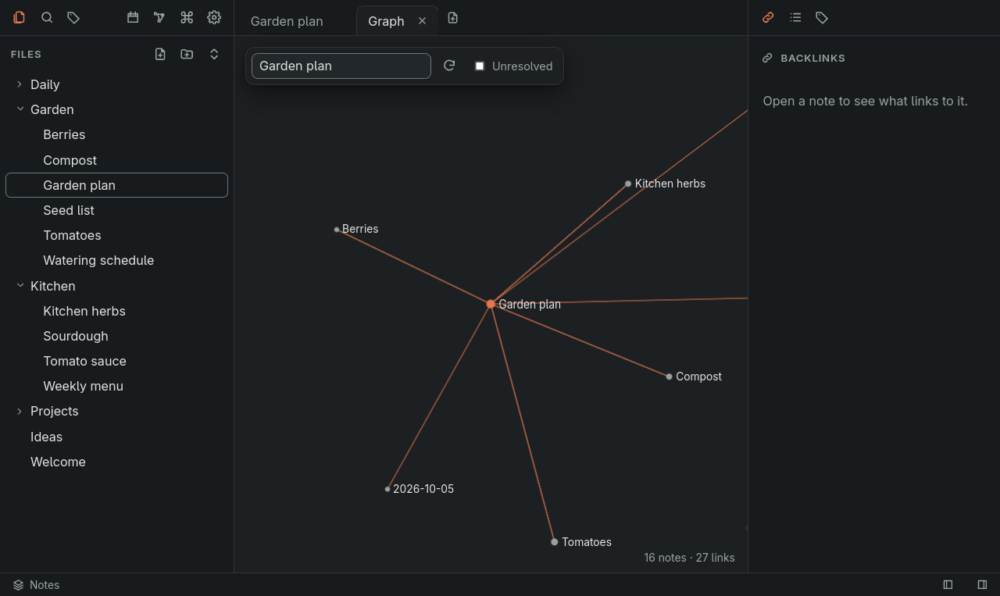

# Search and graph

## Quick switcher

Ctrl+O opens the quick switcher, which finds a note by its name. Before you type, it lists recent notes; once you type, it also lists images.

## Command palette

Ctrl+P opens the command palette, which finds a command by its name and shows its hotkey. Core plugins and plugins that are on add their commands to it.

## Search

Ctrl+Shift+F opens full-text search. Narrow it with `tag:` and `path:` filters, and quote a value with spaces, as in `path:"My Folder"`. Images whose name or folder matches the words are listed under the notes; a query with a tag or a quoted phrase lists none.

## Graph view

Ctrl+G opens the graph view, which shows the notes and the links between them. It also works from the keyboard. Type a note's name in Find note in graph and press Enter to zoom to the note and highlight its links.

