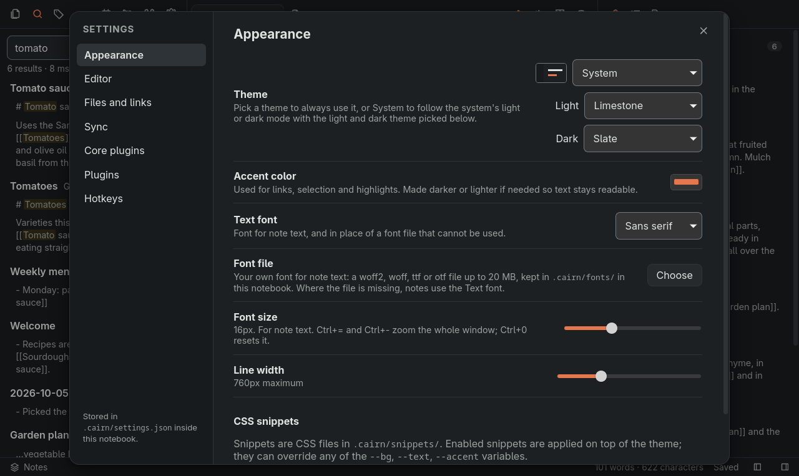

# Themes and appearance

## Themes

Cairn has three light themes and three dark themes:

- Limestone, warm off-white (light)
- Marble, cool white with a blue accent (light)
- High contrast light (light)
- Slate, blue-gray (dark)
- Graphite, neutral gray (dark)
- High contrast dark (dark)

Under Settings, then Appearance, the Theme list holds System and every theme: pick a theme to use it always, or System to follow the system's light or dark mode with the light and dark theme picked under it.

The high-contrast themes keep all text at 7:1 or more (WCAG AAA), except on disabled buttons and a file tree row while it is dragged, and add a ring or bar in the accent color to selected rows, pressed panel buttons and focused controls, so these do not show by a tint alone.

Older versions show Limestone or Slate in a notebook set to a theme they do not have, and keep the choice.

## Colors and fonts

Settings, then Appearance, also has an accent color, a text font, your own CSS snippets, and a font file of your own for note text (woff2, woff, ttf or otf, up to 20 MB). CSS snippets live in `.cairn/snippets/` and the font file in `.cairn/fonts/`, inside the notebook folder. Cairn sync does not copy them, so on another device pick the font file again under Settings, then Appearance, then Font file.

## Zoom and font size

On the desktop, Ctrl+= and Ctrl+- zoom the whole window and Ctrl+0 resets it (on Linux, only on layouts where that key types 0, so not on AZERTY). The Font size setting changes only the note text.
